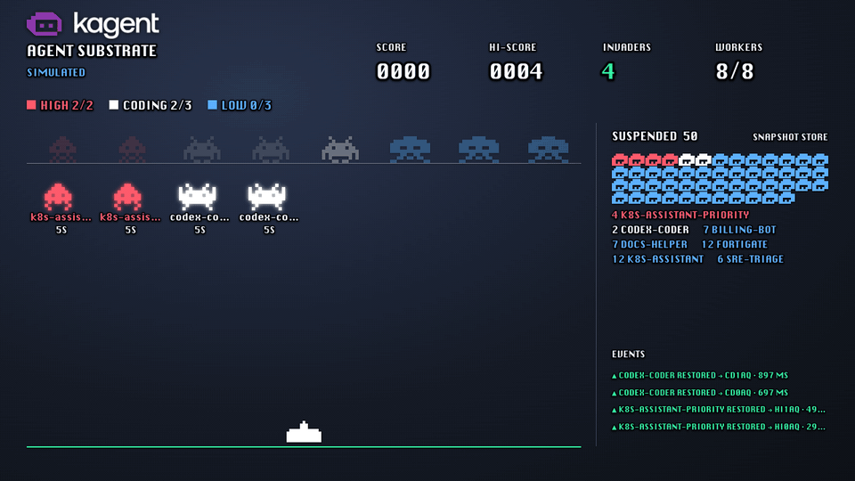
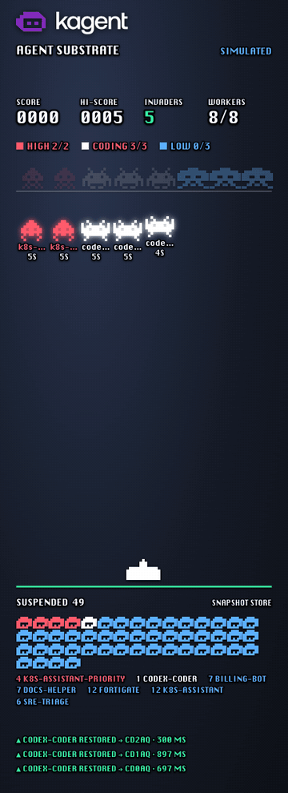
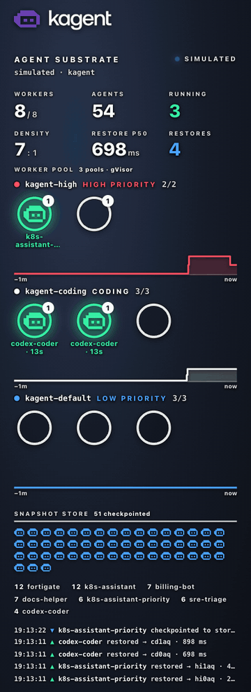

# Substrate HUD

A minimalist, transparent macOS overlay of your **kagent Agent Substrate**:
the worker pool, every agent checkpointed in the snapshot store, and agents
moving in and out of workers as they restore and suspend. Built for OBS.

White structure, **blue** = checkpointed / idle, **green** = running,
**red** = errors, pool short of desired, or an agent waiting on a worker.

## Screenshots

**Space Invaders, landscape** (`?theme=invaders&layout=wide`): each worker is a
column, a running agent's invader falls in its priority colour, and the cannon
shoots it down when the agent checkpoints; the capsule drops into the snapshot store.



<table>
<tr>
<td align="center"><b>Space Invaders, portrait</b><br><code>?theme=invaders</code></td>
<td align="center"><b>Rings + usage graphs</b> (default)<br><code>?theme=rings</code></td>
</tr>
<tr>
<td></td>
<td></td>
</tr>
</table>

Stills: [landscape](docs/media/invaders-landscape.png) ·
[portrait](docs/media/invaders-portrait.png) · [rings](docs/media/rings.png).
Captured in simulated mode (`?sim=1`) over a dark background; in OBS the
background is transparent.

```
kubectl (your kubeconfig, Omni OIDC)
  ├─ get workerpools / worker pods        every 3 s
  ├─ exec ate postgres: actors + worker_assignments   every 15 s
  └─ logs -f ate-api-server  ("Actor state changed", "Picked worker")   live
        │
        ▼
  Substrate HUD.app ──► app window (Tauri, transparent)
                    └─► http://127.0.0.1:7788/  (OBS Browser Source, SSE)
```

## Build & install

Prereqs: Rust, Xcode CLT, `cargo install tauri-cli --version "^2.0" --locked`.

```bash
cd app/src-tauri
CARGO_TARGET_DIR=~/.cache/substrate-hud-target cargo tauri build
cp -R ~/.cache/substrate-hud-target/release/bundle/macos/"Substrate HUD.app" /Applications/
```

The target dir lives outside Google Drive so build artifacts don't sync.
First launch of the unsigned app: right-click → **Open** → **Open**.

Icon: `python3 tools/make_icon.py app/src-tauri/icon-src.png && cargo tauri icon icon-src.png`.

## OBS

Add a **Browser Source** → URL `http://127.0.0.1:7788/`, width **320 × 880** (portrait side rail,
the default; 640×1760 for crisper text). For the wide lower-third strip use
`http://127.0.0.1:7788/?layout=wide` at 720 × 284.
The background is truly transparent (no chroma key). The app must be running.
Hover the app window → **OBS URL** copies it.

Default look: **rings**: workers are circles that glow green with the agent
inside while it runs, and each pool has a line graph of busy workers over the
last 5 minutes (`?chart=10` for 10). `?theme=invaders`: Space Invaders. Each worker
is a column with a hangar; a running agent's invader, coloured by priority (red
high, white coding, blue low), leaves the hangar and slowly falls, and the cannon
shoots it down when it checkpoints (restore and checkpoint latencies pop up).
Errors fly past as the red UFO; agents waiting for a worker hover in red.
Landscape: `?theme=invaders&layout=wide` (or **L** in the app) is a full 16:9
**1280×720** stage: playfield on the left, snapshot store and event feed on the
right. Use a 1280×720 or 1920×1080 Browser Source.
A shot invader drops into the SUSPENDED row (the snapshot store), which is
coloured by priority and grouped by agent with counts. `?theme=timeline`: a lane per worker showing the last 2 minutes
(`?window=5` for 5), where each session leaves a block labelled with its agent,
green while running. The wide strip falls back to bars.
Alternative, `?theme=bars`: one bar per worker pool with a segment per worker;
a segment fills green while an agent runs in it, and each pool shows `busy/total`
(red when full). Bold white text with a strong shadow, transparent background.
Query params: `?theme=rings` (workers as circles), `?theme=wb` (whiteboard; add `?board=1` for the off-white board),
`?theme=glass` (the clean glass look),
`?sim=1` forces simulated traffic.

## Branding

The kagent logo (white wordmark, purple mark: `app/ui/kagent-logo-light.png`, made
from the color logo) sits above *AGENT SUBSTRATE* in every look, and above the
cards in the callouts view.

## Extras

- **Traffic wave:** **T** in the app, *Send traffic wave* in the menu bar, or
  `GET http://127.0.0.1:7788/traffic` (a Stream Deck "website" button) sends one
  real chat each to `@k8s`, `@k8sp`, `@code` and `@forti` through the diary's
  agent-desk (`remarkable-diary/agent-desk`, port-forwarded on demand). In SIM mode it
  fires a simulated burst instead.
- **Callouts for OBS:** a second Browser Source at
  `http://127.0.0.1:7788/?view=callouts` (e.g. 1920×400, bottom of the scene) shows
  big pop-ups such as *FORTIGATE RESTORED · onto 54pnd · 233 ms*, fading after 4 s.
- **Sound:** arcade laser / explosion / beam-in for the invaders look, synthesised in
  the page. Off by default: **N** in the app, or `?sound=1` on the OBS source (tick
  *Control audio via OBS*).
- **Menu bar app:** the HUD lives in the menu bar and turns on *Launch at login* on
  first run (toggle it in the menu). Closing the window only hides it, so the OBS
  sources keep working; *Quit Substrate HUD* in the menu really quits.

## App window

Hover the top-right for controls, or use keys:

| Key | |
| --- | --- |
| **W** | cycle the look: rings (default) → invaders → timeline → bars → whiteboard → glass |
| **T** | send a traffic wave (real chats; a simulated burst in SIM mode) |
| **N** | arcade sound on/off |
| **L** | portrait rail ⇄ wide strip (resizes the window) |
| **B** | board (whiteboard) / dark panel (glass) behind the HUD; off = transparent |
| **P** | keep on top |
| **I** | click-through (Esc to exit) |
| **S** | simulated traffic: for talks or when the cluster is idle |

Drag the window by its top edge.

## Config

Optional `~/.config/substrate-hud/config.json` (all keys optional):

```json
{
  "context": "maniak-omni-viper",
  "ate_namespace": "ate-system",
  "api_server_selector": "app=ate-api-server",
  "postgres_pod": "postgres-0",
  "postgres_container": "postgres",
  "database": "atepg",
  "port": 7788
}
```

Empty `context` means kubectl's current-context.

## Why these data sources

kagent Enterprise on omni-viper doesn't serve `/api/substrate/status` or
`SystemService/GetSubstrateStatus` (what `substrate-scope` uses), and per-actor
state isn't a CRD. So:

- **ate postgres** is ground truth for which actors exist and which worker
  holds them. `worker_assignments.worker_name` is the worker *pod UID*; rows
  pointing at dead pods are stale and ignored. Agent names come from the
  template name embedded in the actor proto (`fortigate-default-<hash>` →
  `fortigate`).
- **ate-api-server logs** give every transition live with timestamps, so
  restore latency = `resuming → running`, checkpoint = `suspending → suspended`.
  The chosen worker comes from the `Picked worker` line with the same `trace_id`.
  The stream restarts every 10 min to pick up new api-server pods.
